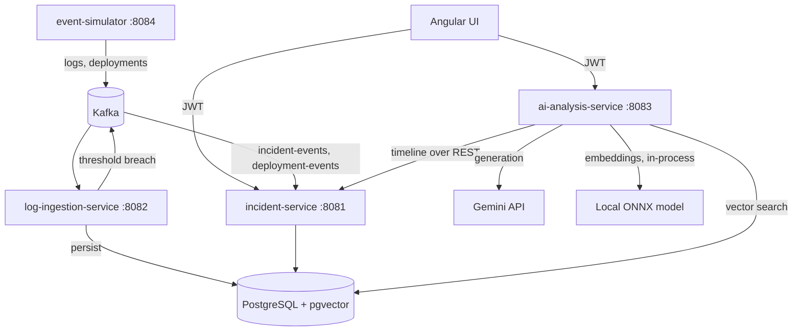

# AI Incident Analysis Platform

An event-driven incident investigation platform for microservices. It ingests logs and deployment
events through Kafka, detects incidents automatically, and uses a RAG pipeline over runbooks and past
incidents to produce a **grounded, cited root-cause analysis** — one where every claim is checked
against the evidence the model was actually shown.

Built with Java 21, Spring Boot 3.5, Apache Kafka, PostgreSQL with pgvector, Spring AI and Angular 19.

---

## The problem

During an incident, the evidence is scattered: logs in one place, deployments in another, the runbook
in a wiki, and the memory of "we've seen this before" in someone's head. Engineers spend the first
minutes of an outage assembling context instead of fixing the problem.

The obvious answer — "ask an LLM" — fails in a specific way: a model with no evidence produces a
confident, plausible, unverifiable root cause. That is worse than no answer, because it is
convincing. This project is about the engineering that makes the answer trustworthy.

## What it does

1. Simulated services emit realistic logs and deployment events into **Kafka**.
2. The **log ingestion service** validates, normalises and stores them, then evaluates an error-rate
   rule on a schedule, the way an alerting engine does.
3. When the rule fires it publishes a detection event, and the **incident service** opens an incident
   and builds a timeline that merges deployments, events and logs.
4. The **AI analysis service** retrieves the relevant evidence — recent timeline, runbooks and past
   incidents from a **pgvector** store — and asks a model for a structured analysis.
5. Every citation in the answer is validated. Claims citing evidence that was never provided are
   stripped, and an answer with no verified claim is downgraded to *insufficient evidence*.

## Measured results

From a run of all five failure scenarios (`scripts/evaluate.sh`):

| Measure | Result |
|---|---|
| Root cause correctly identified | **4 / 4 incidents** |
| Correct historical precedent cited | **4 / 4** |
| Claims citing evidence that was actually provided | **16 / 18** |
| Invented citations caught and removed by validation | **6** |
| Analysis latency | ~4–7 s per incident |
| Prompt size | ~3,000 tokens per analysis |

Five scenarios produce four incidents because two of them affect `payment-service`, and the
deduplication rule folds the second detection into the still-open incident rather than fragmenting
the investigation.

That "6 invented citations" line is the point of the whole design: the model **did** fabricate
references, and the platform caught every one before it reached a user.

## Architecture



| Module | Port | Responsibility |
|---|---|---|
| `common-events` | — | Shared Kafka message contracts |
| `common-security` | — | JWT validation, role mapping, service-to-service tokens |
| `incident-service` | 8081 | Incidents, services, deployments, timeline, token issuing |
| `log-ingestion-service` | 8082 | Kafka consumer, log storage, incident detection |
| `ai-analysis-service` | 8083 | Retrieval, analysis, follow-up chat, model quota control |
| `event-simulator` | 8084 | Generates the five failure scenarios |
| `frontend/incident-ui` | 4200 | Angular UI |

## Design decisions worth explaining

**Retrieval does recall; the model does precision.** The knowledge base deliberately contains a
near-miss pair: INC-003 (connection pool exhaustion after a deployment) and INC-006 (a database
failover) share almost every symptom. Measured similarity scores put them 0.023 apart, so embeddings
alone cannot separate them. Retrieval's job is to get both into the prompt; distinguishing them needs
the evidence that *no deployment occurred*, which is reasoning, not similarity.

**Deployment timing is calculated in code, not asked of the model.** Arithmetic on timestamps is
exactly what a language model gets subtly wrong. The platform computes the gap between deployment,
first error and detection — including the case where errors began *before* the deployment, which is
evidence against it — and gives the model those facts to reason about.

**Chunking follows document structure.** Splitting on a fixed size cuts a numbered resolution
procedure in half, leaving two fragments that neither retrieve nor read well. Chunks split on
markdown sections, and each carries its document title and section so a retrieved fragment can be
identified and cited.

**Evidence is data, not instructions.** Log messages are untrusted text. They are escaped and wrapped
in tagged sections, and the system prompt tells the model to ignore any instruction inside them.

**Every model call is capped, and the caps are tested.** See below.

**Embeddings run locally.** An in-process ONNX model means ingestion costs nothing and consumes no
request quota, leaving the hosted model's budget for generation, where quality actually matters.

## Controlling model spend

A free-tier model allows as few as 20 requests a day, so an unbounded retry loop could exhaust it in
one failure. Every call passes a single guard first:

| Protection | Setting |
|---|---|
| Automatic retries | **1 attempt** (Spring AI defaults to 10) |
| Concurrent calls | 1; extra requests are refused, not queued |
| Per-minute limit | Below the provider's own |
| **Daily budget** | Held in Postgres, counted in the provider's time zone, reserved with an atomic conditional `UPDATE`, and surviving restarts |
| Unchanged evidence | The stored analysis is returned with **no model call** |
| Invalid output | At most one repair call; a response cut off at the token cap gets none |

A refused call returns `429` with `Retry-After` and is logged with `sent_to_provider = false`.
`GET /api/ai/usage` reports consumption against every limit without calling the model.

The test suite can never reach a hosted model: the chat model is stubbed, the endpoint points at an
unreachable address, and a test fails the build if any of those protections is loosened.

## Running it locally

**Prerequisites:** Docker, Java 21, Node 22. A Gemini API key is needed only for analysis and chat;
everything else, including embeddings, runs without one.

```bash
cp .env.example .env         # then put your key in GEMINI_API_KEY
docker compose up -d         # PostgreSQL + pgvector, Kafka
./mvnw clean install         # build and test all modules
```

Start the services (each in its own terminal):

```bash
POSTGRES_PASSWORD=dev_local_only ./mvnw -pl incident-service spring-boot:run
POSTGRES_PASSWORD=dev_local_only ./mvnw -pl log-ingestion-service spring-boot:run
GEMINI_API_KEY=... POSTGRES_PASSWORD=dev_local_only ./mvnw -pl ai-analysis-service spring-boot:run
./mvnw -pl event-simulator spring-boot:run
```

Then the UI:

```bash
cd frontend/incident-ui && npm install && npm start     # http://localhost:4200
```

Generate incidents and load the knowledge base:

```bash
curl -X POST http://localhost:8084/api/simulations/DB_POOL_EXHAUSTION
curl -X POST http://localhost:8084/api/simulations/DEPLOYMENT_REGRESSION
# ... detection runs every 15s

TOKEN=$(curl -s -X POST http://localhost:8081/api/auth/token -H 'Content-Type: application/json' \
  -d '{"username":"admin","password":"admin123"}' | jq -r .accessToken)
curl -X POST -H "Authorization: Bearer $TOKEN" http://localhost:8083/api/knowledge/ingest
```

Sign in at `http://localhost:4200` as `sre` / `sre123`, open an incident, and press **Analyse
incident**.

> Running on 8 GB of RAM: each service fits in a 300 MB heap
> (`-Dspring-boot.run.jvmArguments="-Xmx300m"`), and Kafka can be stopped once incidents exist,
> since analysis does not need it.

## Security

Development accounts: `admin/admin123`, `sre/sre123`, `viewer/viewer123`.

| Role | Can do |
|---|---|
| `USER` | Read incidents, timelines and existing analyses |
| `SRE` | The above, plus raw logs, running an analysis and asking questions |
| `ADMIN` | The above, plus managing the knowledge base |
| `SERVICE` | Internal service-to-service calls only |

Actions that spend a model call are authorised more tightly than read-only ones, which is itself part
of controlling spend. Tokens are signed with a shared secret and issued by a development endpoint so
the platform runs on one machine; swapping in Keycloak means pointing the services at its issuer URI.

## Testing

```bash
./mvnw verify      # 192 tests
```

Integration tests run real PostgreSQL, pgvector and Kafka containers via Testcontainers. Coverage
includes Kafka retry and dead-letter routing, idempotent ingestion, the detection rule, timeline
assembly, chunking and retrieval filtering, output validation and grounding, and every quota limit —
including 20 threads competing for the last 5 slots of a daily budget.

## What is deliberately not here

- **AWS** (S3, CloudWatch): cut to keep the prototype runnable locally.
- **Keycloak**: replaced by an equivalent JWT resource-server setup for memory reasons; the swap is a
  configuration change.
- **Reranking and hybrid search**: they would improve the INC-003 / INC-006 separation and are the
  clear next step, at the cost of latency and complexity.

## Repository layout

```
common-events/          Kafka message contracts
common-security/        JWT validation, roles, service tokens
incident-service/       Incidents, timeline, auth
log-ingestion-service/  Kafka consumer, detection
ai-analysis-service/    RAG pipeline, quota control, chat
event-simulator/        Failure scenario generator
frontend/incident-ui/   Angular UI
sample-data/            5 runbooks, 7 historical incidents
scripts/evaluate.sh     Scores analyses against known answers
docker/                 Service image definition
.github/workflows/      CI: build, test, frontend build, image build
```
